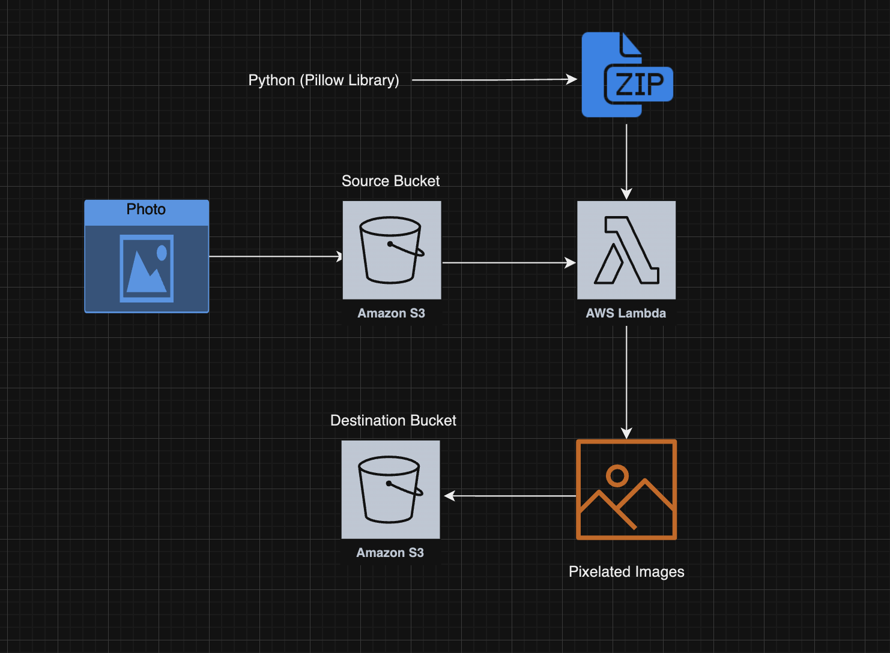

# Event-Driven Image Processing Pipeline with AWS Lambda and S3

## This project demonstrates how to build an automated, event-driven image processing pipeline using AWS Lambda and S3. When an image is uploaded to a source S3 bucket, an AWS Lambda function is triggered, which processes the image by pixelating it into five different resolutions: 8x8, 16x16, 32x32, 48x48, and 64x64, using the Pillow (PIL) library. The processed images are then stored in a processed S3 bucket. This project leverages a fully serverless architecture, ensuring scalability and cost-effectiveness.

### What You Will Learn
- **Event-Driven Architecture**: Trigger AWS Lambda functions in response to S3 events.  
- **Image Processing with Python**: Use the Pillow library to manipulate images, including pixelation.  
- **S3 Bucket Management**: Handle objects across multiple S3 buckets, including permissions and event notifications.  
- **Error Handling**: Implement best practices for reliable Lambda function execution.  
- **Serverless Deployment**: Deploy a fully serverless pipeline on AWS for real-time, automated tasks.

---

### Pixelation Use Cases
- **Privacy Protection**: Anonymize sensitive areas in images.  
- **Creative Design**: Create retro or abstract art and stylized effects.  
- **Data Reduction**: Generate low-resolution previews for bandwidth efficiency.  
- **Compression Previews**: Use pixelation for progressive loading in videos or images.  
- **Machine Learning**: Simplify images for training models or pattern recognition.

---

### Project Workflow
1. **Create S3 Buckets**  
   - Source bucket: `amc-image-pixelater-source`.  
   - Processed bucket: `amc-image-pixelater-processed`.  

2. **Develop the Lambda Function**  
   - Write the `lambda_function.py` code to pixelate images.  
   - Package the function and dependencies into a `.zip` file.  

3. **Deploy and Configure Lambda**  
   - Upload the function to AWS Lambda.  
   - Configure triggers and permissions.  

4. **Test and Monitor**  
   - Validate functionality and monitor logs.  

---

### Outcome
You’ll create an automated, serverless image processing pipeline that pixelates images at multiple resolutions. Processed images will be stored in a separate S3 bucket, providing a scalable and efficient solution for real-time tasks.
